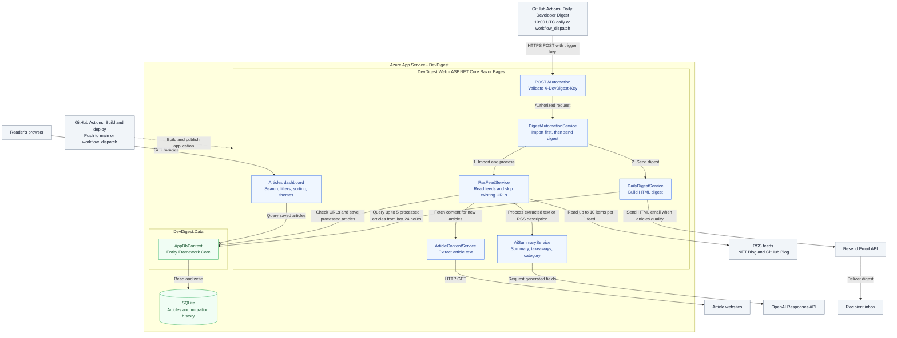
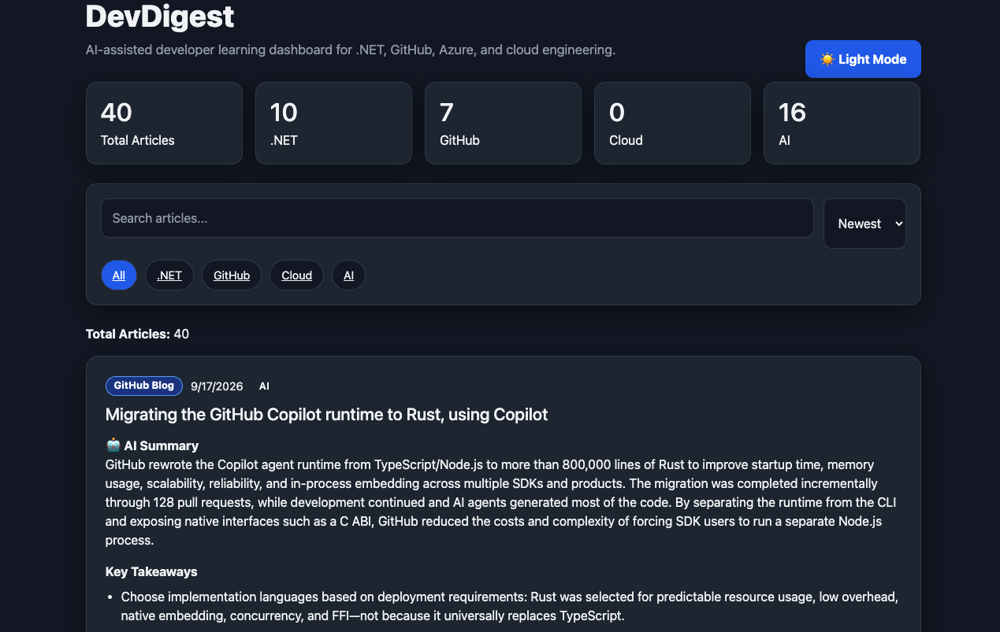
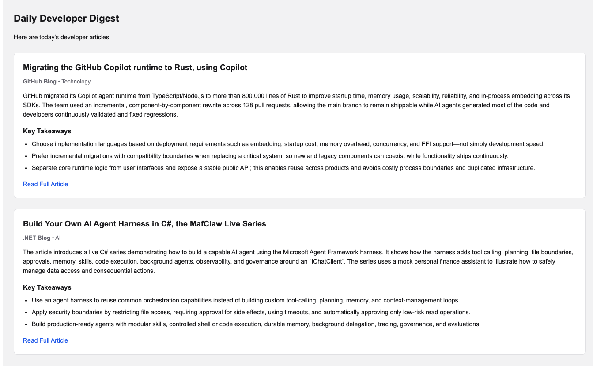
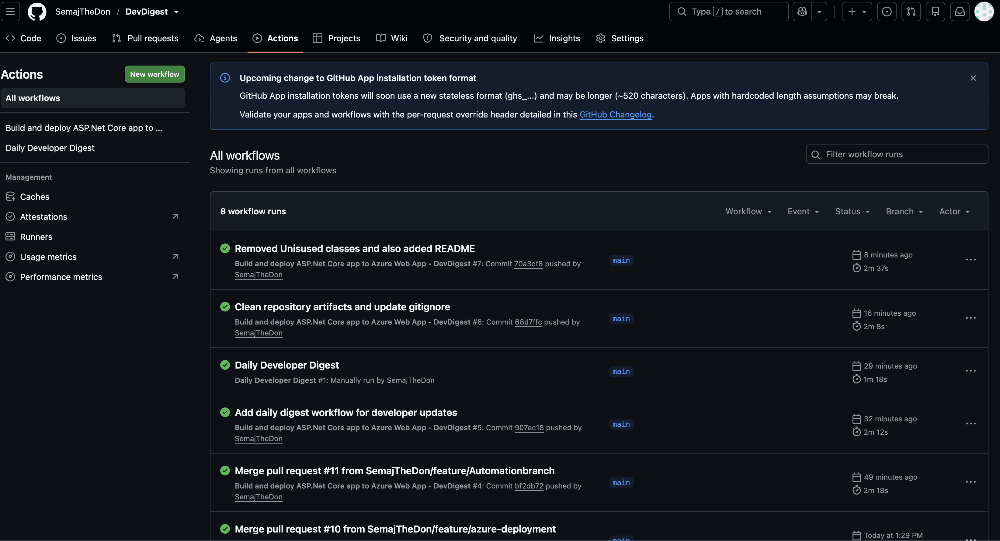
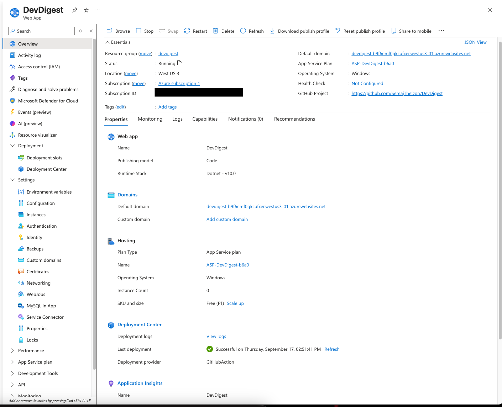

# DevDigest

DevDigest is an ASP.NET Core Razor Pages application that turns developer news into a searchable dashboard and a daily email digest. It imports RSS articles, extracts article content, and uses AI to generate short summaries, three key takeaways, and categories.

## Features

- Import articles from the .NET Blog and GitHub Blog, skipping URLs already in the database.
- Generate AI summaries and takeaways using the OpenAI Responses API.
- Browse articles with search, category filters, and sorting by date or source.
- View article counts by category and switch between light and dark themes.
- Send an HTML email digest through Resend.
- Run the import-and-email pipeline on a daily GitHub Actions schedule, with on-demand runs available from GitHub Actions.

## Architecture

The Razor Pages application runs on Azure App Service. GitHub Actions triggers the daily pipeline, while the dashboard reads saved articles through Entity Framework Core.



Solid arrows show requests and service calls; responses return to the caller. The dashed arrow shows deployment. AI-generated fields are applied to each article before the RSS service saves it. GitHub Actions owns scheduling; the application has no in-process scheduler or dashboard send/import actions.

## Screenshots

### Articles dashboard

The dark-theme dashboard shows article counts, search and category filters, AI summaries, and key takeaways.



### Daily email digest

The email digest presents article summaries, key takeaways, and links to the full articles.



Deployment and automation screenshots appear in their corresponding sections below.

## Technology

| Component | Technology |
| --- | --- |
| Application | C#, .NET 10, ASP.NET Core Razor Pages |
| Storage | SQLite and Entity Framework Core 10 |
| RSS ingestion | CodeHollow.FeedReader |
| Content extraction | HtmlAgilityPack |
| AI processing | OpenAI .NET SDK |
| Email | Resend HTTP API |
| Deployment and scheduling | Azure App Service and GitHub Actions |

## Run locally

Prerequisites: the .NET 10 SDK. Running the automation pipeline also requires an OpenAI API key with access to your configured model and network access to the feeds and article sources. Resend configuration is required to send email.

From the repository root:

```bash
dotnet restore DevDigest.slnx
dotnet user-secrets set "OpenAI:ApiKey" "YOUR_OPENAI_API_KEY" --project DevDigest.Web
dotnet run --project DevDigest.Web --launch-profile http
```

Open **http://localhost:5091/Articles** to access the dashboard. The application applies EF Core migrations at startup and creates the SQLite database automatically; no separate database server or migration command is needed.

The dashboard displays stored articles and does not import articles or send email. GitHub Actions triggers the pipeline through the protected `/Automation` endpoint. For local pipeline testing, use the endpoint example under [Automation](#automation).

An OpenAI key is needed only when running the pipeline; browsing the dashboard does not require one. The model configured in `appsettings.json` is `gpt-5.6-luna`; override `OpenAI:Model` if your account requires a different model.

### Configure email

Set your Resend API key, sender address, and recipient:

```bash
dotnet user-secrets set "Resend:ApiKey" "YOUR_RESEND_API_KEY" --project DevDigest.Web
dotnet user-secrets set "Digest:FromEmail" "DevDigest <digest@example.com>" --project DevDigest.Web
dotnet user-secrets set "Digest:ToEmail" "you@example.com" --project DevDigest.Web
```

Use a sender address authorized for your Resend account.

## Configuration

Use .NET user secrets for local development and environment variables for deployment. Keep credentials out of committed configuration files.

| Configuration key | Environment variable | Purpose / default |
| --- | --- | --- |
| `ConnectionStrings:DefaultConnection` | `ConnectionStrings__DefaultConnection` | SQLite connection; defaults to `Data Source=devdigest.db` |
| `OpenAI:ApiKey` | `OpenAI__ApiKey` | Required by the AI processing pipeline |
| `OpenAI:Model` | `OpenAI__Model` | Model name; defaults to `gpt-5.6-luna` |
| `Resend:ApiKey` | `Resend__ApiKey` | Required to send email |
| `Digest:FromEmail` | `Digest__FromEmail` | Digest sender |
| `Digest:ToEmail` | `Digest__ToEmail` | Digest recipient |
| `DigestAutomation:TriggerKey` | `DigestAutomation__TriggerKey` | Shared secret required by `POST /Automation` |

## How the digest works

1. Read up to 10 items from each configured feed.
2. Skip articles whose URLs already exist in SQLite.
3. Fetch article HTML, remove script/style and common layout elements, and extract up to 12,000 characters of text. Fall back to the RSS description if extraction fails.
4. Request a summary, three takeaways, and a category from the AI service, then save the articles.
5. Select up to five successfully AI-processed articles published within the previous 24 hours, newest first, and send an HTML email. If none qualify, no email is sent.

Feed URLs are defined in [RssFeedService.cs](DevDigest.Web/Services/RssFeedService.cs). Edit its feed dictionary to change sources.

## Automation

### GitHub Actions

[daily-digest.yml](.github/workflows/daily-digest.yml) calls the deployed application's `POST /Automation` endpoint daily at **13:00 UTC**. It also supports manual runs through `workflow_dispatch`.

The GitHub Actions run history shows the deployment and Daily Developer Digest workflows.



Configure these GitHub repository secrets:

| Secret | Value |
| --- | --- |
| `DEVDIGEST_URL` | Deployed application base URL, without a trailing slash |
| `DEVDIGEST_TRIGGER_KEY` | The same value as the application's `DigestAutomation:TriggerKey` |

Set `DigestAutomation__TriggerKey` in the deployed application's environment along with the AI and email settings. The endpoint checks the `X-DevDigest-Key` request header and returns HTTP 401 when the key is missing or incorrect.

For a local manual trigger, configure the key and restart the app:

```bash
dotnet user-secrets set "DigestAutomation:TriggerKey" "YOUR_TRIGGER_KEY" --project DevDigest.Web
```

Then call the endpoint from another terminal:

```bash
curl --fail-with-body -X POST http://localhost:5091/Automation \
  -H "X-DevDigest-Key: YOUR_TRIGGER_KEY"
```

## Build and deployment

```bash
dotnet build DevDigest.slnx --configuration Release
dotnet publish DevDigest.Web/DevDigest.Web.csproj --configuration Release --output ./publish
```

[main_devdigest.yml](.github/workflows/main_devdigest.yml) builds and publishes on pushes to `main` or manual dispatch, then deploys to the Azure App Service named `DevDigest`, in its `Production` slot. To use your own Azure environment, update the app name and configure the Azure identity and matching repository secrets referenced in that workflow.

Supply application settings through the hosting environment. Point the SQLite connection string at a writable, persistent location so database contents survive deployments. Migrations run whenever the application starts.

The Azure App Service overview shows the hosted DevDigest application and its deployment status.



## Project structure

```text
DevDigest.slnx
DevDigest.Web/
  Pages/                 Razor Pages dashboard and automation endpoint
  Services/              RSS, article extraction, AI, email, and orchestration
  wwwroot/               Stylesheets and JavaScript
  Program.cs             Service registration and startup migrations
  appsettings.json       Default application configuration
DevDigest.Data/
  Data/AppDbContext.cs   EF Core database context
  Models/Article.cs      Article and AI-generated fields
  Migrations/            SQLite schema migrations
.github/workflows/       Azure deployment and daily digest trigger
docs/screenshots/        Dashboard, email, automation, and hosting screenshots
```

## Current behavior and limitations

- Existing article URLs are skipped, including articles whose AI processing previously failed; importing again does not retry them.
- Email delivery is not tracked. Repeated manual or scheduled runs can send the same eligible articles again.
- The automation endpoint's success response does not guarantee email delivery: services catch or log several failures. Check application logs for AI and Resend results.
- The Articles dashboard is publicly readable. Import and email operations run through the `/Automation` endpoint, which requires the trigger key.
- There is no automated test project in the repository.

## Troubleshooting

| Symptom | Check |
| --- | --- |
| “OpenAI API key has not been configured.” | Set `OpenAI:ApiKey` for the web project or `OpenAI__ApiKey` in the deployed environment. |
| Dashboard has no articles | Run the GitHub Actions digest workflow or the protected automation endpoint; opening the page does not import feeds. Inspect logs for feed or database errors. |
| Articles have no AI summary | Check the API key, model access, and AI processing logs. Existing URLs are not automatically retried. |
| No digest email arrives | Confirm Resend settings and that at least one processed article was published in the last 24 hours; inspect email delivery logs. |
| Automation returns HTTP 401 | Match the `X-DevDigest-Key` header to the configured trigger key. |
| SQLite cannot open or write the database | Check the connection string and write permissions for the database directory. |
